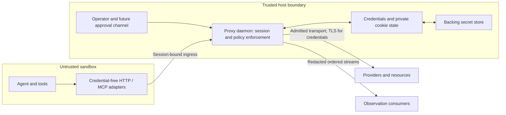

# Architecture and trust boundaries

## Roles

The **agent sandbox** contains the agent, its tools, and any credential-free
client adapters. Treat all of it as potentially compromised, including local
MCP servers, prompts, tool results, repository configuration, and HTTP headers.

The **daemon** authenticates sandbox sessions, authorizes requests, controls
upstream connections, holds credentials, and produces observation events. Its
credential boundary includes the interception CA private key, passwords,
provider API keys, token refresh state, cookie jars, and security state.
Persistent credentials are backed by a secret store. The daemon exposes a
scoped password-manager interface through MCP; the store itself, its native
record identifiers, and its unlock credentials are not exposed to the agent.
Custody uses a pluggable interface: direct Keychain storage on macOS, encrypted
SQLite by default elsewhere, or a trusted host-supplied backend. Existing
accessible Keychain items may be enrolled by reference without duplication.
See [secret stores](secret-stores.md).

The daemon composes reusable Rust libraries. A trusted application may embed
the same engine, but doing so brings that process into the credential boundary;
embedding it inside untrusted agent code does not preserve isolation.

The **operator/control plane** provisions identities, destinations, accounts,
grants, policy, and revocation. It is separate from agent-facing traffic. The
agent cannot install resource profiles, enroll trust roots, change grants,
select arbitrary secret-store entries, or turn off observation requirements.

An **upstream resource** is a model provider, MCP server, website, API, or
approved TCP service. It uses its existing authentication protocol. Observation
consumers and future human approvers have separate authenticated interfaces and
privileges.

The sandbox enforcement layer MUST make the daemon the only available egress
path. This includes DNS and IPv6, local host services, alternate proxy sockets,
inherited file descriptors, container networking, and tool subprocesses.
QUIC/UDP is denied in the baseline; HTTP clients must use supported transports.
The daemon's own DNS, metadata, authorization, redirect, and secret-store
traffic is subject to policy too.

The [deployment contract](deployment.md) assigns OS confinement to a trusted
launcher and defines the actual bypass tests. Distinguish credential brokerage,
confined external communication, and inspected protocol coverage in claims;
none alone proves the other two. The daemon is not itself a sandbox launcher.

## Architectural responsibilities

These are responsibility boundaries. Their package mapping is specified in
[the Rust workspace plan](rust-workspace.md).

| Responsibility | Required behavior |
| --- | --- |
| Session admission | Bind a host-established tenant/agent/job identity to ingress; enforce lifetime and revocation |
| Routing and policy | Resolve permitted resource/account profiles; authorize action, destination, and limits |
| Transport mediation | Parse supported protocols, terminate enrolled TLS, relay approved streams, reject ambiguity |
| Authentication custody | Substitute fake credentials, inject API credentials, own private cookie/token state |
| Password manager | Discover authorized site/items, return fake login values, resolve versioned store secrets |
| Observation | Export redacted content and decision events with provenance and explicit gaps |
| Control and approval | Provision, revoke, and approve using a channel inaccessible to agent code |

The daemon admits only requests authorized for the agent's session. Its agent
API exposes credential placeholders and authenticated operations; real secrets
remain private. The daemon sends the authenticated request itself and returns
only its safe response view.

## Transport coverage

| Traffic | Mediation and inspection | Authentication boundary |
| --- | --- | --- |
| Model HTTP API | Fixed approved routes, parsed request policy, streamed response/SSE observation | Provider key/token inserted by daemon |
| HTTPS forward proxy / CONNECT | TLS terminates at daemon after destination admission; HTTP parsed inside tunnel | Per-resource form/cookie or API authentication profile |
| Explicit MCP internet-access tool | Typed destination/method/body input maps to the same HTTP policy path | Tool never accepts or returns real credentials |
| Remote MCP over HTTP | Separate local MCP server and upstream MCP client roles; JSON-RPC and HTTP correlated | Daemon owns upstream MCP authentication |
| Local MCP over stdio | Mediated launcher/stdio channel and constrained child egress | No secret-bearing environment passed to untrusted child |
| Plain TCP | Destination-bound byte stream, lifecycle events, byte observation where plaintext | No generic field substitution; protocol adapter required |
| TLS for a non-HTTP protocol | Inspection only with compatible TLS endpoints and a supported protocol profile | No assumption that HTTP auth works for that protocol |
| Pinned TLS / end-to-end encrypted payload | Unsupported for full inspection; reject by default | No assertion of plaintext visibility |
| WebSocket | Inspect admitted HTTP upgrade and subsequent frames when explicitly supported | Handshake authentication does not authorize every later operation |

The [first TCP relay contract](tcp.md) permits only explicitly enrolled,
credential-free byte channels. It defines bounded duplex and half-close
behavior, connection-level approval, and honest unparsed coverage. It cannot
substitute for HTTP/MCP inspection or authorize individual application actions;
no failed inspected connection falls back to this relay.

An MCP server's own external traffic is visible only if that server is inside
the confined deployment or otherwise enrolled behind a mediator. A remote MCP
server and a provider-hosted tool can make further network calls outside this
daemon's view. Full-coverage policies MUST deny such capabilities unless their
egress is separately mediated and its coverage is recorded.

MCP connection/session identifiers are correlation values, not evidence of
identity. Bind every request to the admitted local session. Server-initiated
requests, sampling, elicitation, notifications, and nested tool invocations
receive policy checks as well. Prompt text and tool descriptions cannot grant
additional authority.

Upstream MCP session headers are nevertheless private security state, not
agent-facing correlation handles. The [first remote profile](remote-mcp.md)
keeps them in a trusted protocol adapter, with an explicit tool allowlist and
no automatic replay. Its preprovisioned credential path does not claim OAuth
discovery/refresh support; the broader authorization boundary below applies
when that integration is separately implemented.

For standard MCP HTTP authorization, preserve separate upstream credentials
and audience validation. The daemon is an OAuth client to the upstream; it
does not pass the agent's inbound token through as the upstream token.
[MCP authorization](https://modelcontextprotocol.io/specification/2025-11-25/basic/authorization)

## TLS and destination rules

The sandbox receives only the public interception trust root. Its private key
and signing access stay outside the sandbox. Scope that root to enrolled
clients; never install it globally as an incidental step. The daemon validates
the real upstream certificate and hostname independently. Trust of the local
interception CA does not excuse invalid upstream TLS. Upstream mutual-TLS keys,
if a resource requires them, also remain in the daemon.

The admitted origin, CONNECT authority, TLS server name, HTTP authority, and
selected credential profile MUST agree. A client cannot use a permitted tunnel
to select another virtual host. HTTP/2 streams receive independent request
checks; cross-origin connection reuse cannot bypass origin policy.

The daemon resolves destinations, evaluates all candidate addresses, and binds
the actual connection to an approved address. Re-resolution, redirects, Alt-Svc,
metadata URLs, and subsequent connections require fresh checks. Deny host-local,
link-local, metadata, private, multicast, and other special destinations unless
an operator explicitly enrolled the exact service. An approved domain does not
grant access to every service sharing its IP address. Restrict schemes and ports;
reject URL userinfo, fragments, ambiguous authority, and unsupported encodings.

TLS early data is disabled on authenticated request paths to avoid introducing
transport-level replay of authenticated operations. This does not provide
application idempotency or change an upstream credential's properties.
[RFC 8470](https://www.rfc-editor.org/rfc/rfc8470.html)

## Request and response path

1. Identify the local session from its trusted ingress binding. Parse and
   bound the request; reject conflicting framing, duplicate singleton fields,
   ambiguous authority, unsupported content encodings, and malformed protocols.
2. Resolve the resource/account profile and authorize the complete operation,
   including provider-side tools, tool arguments, method, target, and quotas.
3. Freeze the permitted request. Emit its redacted agent-side representation.
   Obtain approval if required. Select and validate the upstream connection.
4. Perform authentication preparation: validate credential placeholders and
   select the permitted store item, token, or cookie jar. Recheck session,
   grant, credential version, destination, and approval immediately before send.
5. Substitute the declared credential fields or inject authentication headers
   at the final outbound boundary. Recompute framing after transformations;
   preserve the approved destination and action. Emit a redacted upstream view
   and mutation metadata.
6. On every response, including errors, redirects, informational messages, and
   trailers, capture private authentication state before exposing any content.
   Apply the route's response profile, emit safe observation, and deliver the
   sanitized result or stream to the agent.

Do not forward agent-supplied authentication fields as an alternative to
daemon-managed authentication. Proxy metadata never goes upstream by accident.
Disable shared authenticated response caches in the baseline. Any later cache
must partition by identity/account/grant and recheck authorization on reads.

Model streams preserve ordering, cancellation, and terminal error information.
A midstream denial or upstream disconnect produces an explicit incomplete-stream
result; a truncated response must not be presented as successful completion.
Request, byte, duration, concurrency, and provider-usage ceilings constrain each
session. Provider-reported token usage is evidence, not the sole resource limit.

## Threat model and limits

Assume malicious agent requests, prompt injection, token/placeholder theft from
the sandbox, DNS rebinding, hostile redirects, conflicting parsers, malicious
tool metadata, replay, consumer outages, and racing requests. Defend against
cross-session credential use and confused-deputy requests even if the attacker
already controls one admitted agent.

The trusted computing base includes sandbox enforcement, the daemon, control
plane, credential custody, and any component allowed to see
raw authenticated traffic. A compromised host or daemon can exercise stored
credentials. A malicious resource that legitimately receives a password can
leak it in arbitrary encodings; no universal filter can prevent that. Restrict
credential destinations and document response transformations per supported
resource. Plaintext content can contain user data and prompt injection even
when credentials are removed.

Revocation stops new dispatches, closes applicable long-lived streams, cancels
pending operations, and discards session-bound credentials/handles. It cannot
undo a request already admitted at the remote service. Restart invalidates local
sessions and transient fake passwords by default; persistent security state must
not resurrect expired placeholders, revoked authority, or another session's jar.
