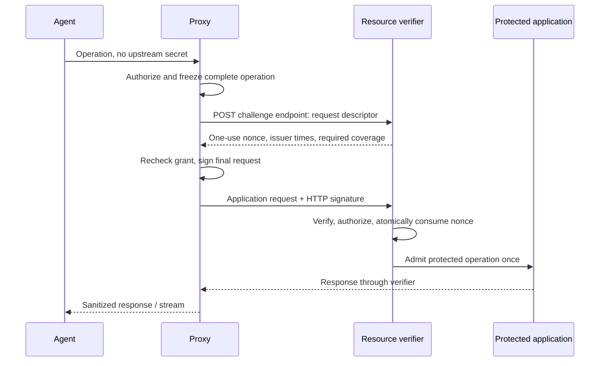

# AAP-CR/1: one-use resource challenge-response

## Status, purpose, and prerequisites

`AAP-CR/1` is a proposed project-specific HTTP authentication profile, not
AAuth or a registered authentication scheme. It combines standard HTTP Message
Signatures with a mandatory server challenge and stateful, one-use acceptance.
It authenticates the proxy acting for an enrolled agent; the agent never holds
the signing key or receives the signed outbound request.

HTTP Message Signatures supplies the signature-base construction, component
identifiers, `Signature-Input`, and `Signature` fields. This profile requires
explicit component coverage and `created`, `expires`, `keyid`, `alg`, `tag`,
and server-selected `nonce` parameters. [RFC 9421](https://www.rfc-editor.org/rfc/rfc9421.html)

The resource or a trusted gateway in front of it MUST implement this profile.
A client-only proxy cannot make an arbitrary website enforce server-side
one-use authentication. The gateway, if used, is part of the resource's trust
boundary and must prevent clients from reaching an unprotected application
route around its checks.

The baseline uses a pre-enrolled Ed25519 public key. Enrollment binds `key_id`
to a principal and allowed resource grants; `key_id` is an opaque lookup key,
never a URL fetched on the caller's instruction. A grant binds the enrolled
principal to a particular agent identity, account, resource, allowed actions,
and expiry. Enrollment and grant administration occur outside the agent channel.
Dynamic enrollment and federated grant issuance are later profiles.

## Wire conventions and request binding

All exchanges use verified HTTPS. The profile version is `1`; the signing tag
is `aap-cr-1`. Custom `AAP-*` fields and the challenge path below are provisional
project names and require interoperability review before public deployment.

Opaque identity fields (`key_id`, agent, session, grant) use 1–128 ASCII
characters from `[A-Za-z0-9._~-]`. They are resource-specific pseudonymous
identifiers; no global identity or secret-store key is revealed. The proxy
establishes a fresh random session alias for each resource and local session.
`AAP-Request-ID` uses the 16-byte base64url identifier from the common protocol.
Times are integer Unix seconds. Base64url values have no padding.

The final request MUST contain exactly one of each field:

| Field | Meaning |
| --- | --- |
| `AAP-Version` | Literal `1` |
| `AAP-Agent` | Enrolled agent identifier derived from the local session |
| `AAP-Session` | Proxy-assigned resource-specific session alias |
| `AAP-Grant` | Enrolled authorization grant identifier |
| `AAP-Request-ID` | Identifier for this operation |
| `Content-Type` | Approved media type; `application/octet-stream` if none was specified |
| `Content-Digest` | SHA-256 digest of the exact final content, including empty content |
| `Signature-Input` | The single `aap` signature input specified below |
| `Signature` | The corresponding `aap` Ed25519 signature |

`Content-Digest` uses `sha-256=:BASE64_DIGEST:` with ordinary padded base64
inside the colons, as defined for HTTP digest fields. It covers content bytes,
not HTTP framing. The resource recomputes it before admitting the application
request. [RFC 9530](https://www.rfc-editor.org/rfc/rfc9530.html)

For this version, request content encoding and request trailers are not
supported. The full bounded request body is finalized before challenge
acquisition. Streaming responses are unrestricted by this requirement;
unbounded signed uploads require a future profile.

Required covered components, in exactly this order:

```text
"@method" "@target-uri" "content-digest" "content-type"
"aap-version" "aap-agent" "aap-session" "aap-grant" "aap-request-id"
```

Any other application header permitted by the resource profile is appended
once in lowercase ASCII lexical order and MUST be covered too. Examples are
`accept`, `if-match`, an application idempotency field, or an MCP session field.
This version does not combine ordinary bearer/cookie authorization with strict
authentication. Reject `Authorization`, `Cookie`, and caller-supplied signatures
on the strict route. The proxy constructs its own `AAP-*` fields.

Transport fields such as framing and hop-by-hop fields are not application
inputs. They must be validated or removed and cannot override routing or
authorization. A resource profile cannot rely on an unsigned application field.
Reject duplicate singleton fields and unsupported component parameters or
additional signature labels; one unambiguous signature is required in v1.

The target URI is the externally visible final request URI. Use HTTPS, a
lowercase ASCII host, omit the default port, and use `/` for an empty path.
Reject userinfo, fragments, backslashes, invalid percent escapes, and dot
segments (including percent-encoded dot segments). Preserve path escaping and
query bytes/order otherwise; do not sort query parameters or decode/re-encode
the request after signing. Route policy and verification must use the same
interpretation. `@target-uri` includes the query, preventing query substitution.

A resource front end MUST reconstruct that external URI from trusted connection
and routing information, never arbitrary `Forwarded` headers. Verify before any
rewrite that would lose it. If proxy and resource cannot agree on a single
interpretation, reject the request.

## Exchange



The challenge endpoint is an operator-configured, same-origin HTTPS path; the
example/default path is `/_aap/v1/challenges`. It is not a standardized well-known
endpoint. It MUST NOT redirect, execute the described application action, or
accept arbitrary endpoints for key discovery. Challenge issuance is bounded and
rate-limited, including for unauthenticated callers.

The proxy sends `POST` with `Content-Type: application/json` and this schema:

```json
{
  "version": 1,
  "key_id": "key-7",
  "method": "POST",
  "target_uri": "https://tasks.example/api/tasks?mode=once",
  "headers": {
    "content-digest": "sha-256=:BASE64_DIGEST:",
    "content-type": "application/json",
    "aap-version": "1",
    "aap-agent": "agent-7",
    "aap-session": "RESOURCE_SESSION_ALIAS",
    "aap-grant": "grant-42",
    "aap-request-id": "BASE64URL_16_BYTES"
  }
}
```

Uppercase example values are explanatory placeholders, not cryptographic test
vectors. The JSON object has exactly these fields; `headers` contains every
covered field, with lowercase names and string values after RFC 9421 field
canonicalization. Reject duplicate JSON members, unknown top-level members,
unknown/forbidden headers, wrong types, oversized input, and invalid formats.
JSON member ordering is insignificant. No custom JSON-signing canonicalization
is used: the stored descriptor is compared against canonical HTTP components.

The verifier validates the origin, supported route, key enrollment, identity,
grant shape, and size constraints without performing the application action.
It then stores a challenge record binding:

- A cryptographically random 32-byte nonce, encoded base64url (43 characters).
- Resource identity and current verifier epoch.
- Enrolled key, agent, session, and grant.
- Method, exact target URI, complete canonical covered fields, and body digest.
- Issuance time, expiry, required coverage, and state `issued`.

The verifier responds `201 Created`, `Content-Type: application/json`, and
`Cache-Control: no-store`:

```json
{
  "version": 1,
  "nonce": "BASE64URL_32_BYTES",
  "issued_at": 1789992000,
  "expires_at": 1789992060,
  "audience": "https://tasks.example",
  "key_id": "key-7",
  "request_id": "BASE64URL_16_BYTES",
  "covered_components": [
    "@method", "@target-uri", "content-digest", "content-type",
    "aap-version", "aap-agent", "aap-session", "aap-grant", "aap-request-id"
  ]
}
```

These are the exact response fields. `audience` is the normalized resource
origin, including a non-default port. Expiry is no later than 60 seconds after
issuance. A shortened lifetime is allowed. The proxy validates the TLS peer,
version, audience, key, request ID, freshness, and exact required coverage.
An unexpected coverage list is an error, not permission to sign a weaker request
or extra data. A challenge is never accepted from agent content or another origin.

The proxy creates the final signature using RFC 9421 serialization, label `aap`,
the component list above, and these parameters in the order shown:

```text
Signature-Input: aap=("@method" "@target-uri" "content-digest" "content-type" "aap-version" "aap-agent" "aap-session" "aap-grant" "aap-request-id");created=1789992001;expires=1789992031;nonce="BASE64URL_32_BYTES";keyid="key-7";alg="ed25519";tag="aap-cr-1"
Signature: aap=:BASE64_SIGNATURE:
```

`Signature` uses ordinary padded base64 for the 64-byte signature. The private
key is held by the daemon or its trusted signing store. The signature base
includes the signature parameters through the RFC's `@signature-params`
construction. There is no bespoke password-derived MAC or raw-concatenation
signature algorithm.

## Verification and one-use state

Before any protected side effect, the verifier MUST:

1. Validate request framing, version, permitted headers, component list, all
   mandatory signature parameters, and `alg="ed25519"` / `tag="aap-cr-1"`.
2. Look up the opaque nonce in the current resource epoch. Require the matching
   key/agent/session/grant and exact stored request descriptor. Only `issued`
   records can proceed to admission; a retained `consumed` record can proceed
   only far enough to authenticate a replay error.
3. Recompute the full body digest and verify the RFC 9421 signature using the
   enrolled public key. Self-supplied keys or algorithm changes are not accepted.
4. Enforce times using the verifier's clock: `now < challenge.expires_at`,
   `now < signature.expires`, `0 < expires - created <= 30`,
   `expires <= challenge.expires_at`, `created >= challenge.issued_at - 5`,
   `created <= now + 5`, and `now - created <= 35`. Expiry has no extra grace
   period. A clock anomaly that prevents safe evaluation fails closed.
5. Check current key and grant validity, permitted agent/account, requested
   action, limits, and resource authorization. Cryptographic identity does not
   itself authorize an operation.
6. Atomically admit the operation by changing the bound nonce from `issued`
   to `consumed`, with freshness, grant revocation, and limits rechecked at this
   admission boundary.
   Exactly one concurrent contender may succeed. Dispatch only that winner.

Invalid signatures do not consume a valid challenge, but validation attempts
are rate-limited. Consumed, expired, missing, and old-epoch challenges are never
accepted. Keep consumed state through the original expiry; after expiry a
missing record is still rejected. A self-contained signed challenge with no
consumption tracking is insufficient.

All resource verifier instances that can admit the same challenge MUST share
one logical consumption decision or route it to a single authoritative owner.
If the authoritative decision is unavailable, reject. Recovery must either
preserve consumption decisions or invalidate the entire old challenge epoch;
restoring an old snapshot of `issued` records as usable is forbidden.

A crash after consumption can lose the operation before execution. A lost
response can hide a completed operation. The guarantee is **at-most-once
admission for a challenge**, not guaranteed completion or exactly-once business
execution. Issuing a new challenge for the same action is a new authentication
attempt and cannot be used as an implicit business retry mechanism.

## Responses and failures

Challenge-endpoint failures and verifier failures use JSON
`{"error":"CODE"}`, plus `Cache-Control: no-store`. The protected application
never receives a verifier-rejected request. Do not include signatures, private
credentials, or detailed grant-enumeration diagnostics in errors.

| HTTP status | Error | Meaning |
| --- | --- | --- |
| 400 | `invalid_request` | Malformed descriptor, framing, or profile fields |
| 401 | `authentication_failed` | Unknown key/grant binding, missing proof, bad signature, unknown nonce, or descriptor mismatch |
| 401 | `challenge_expired` | Validly identified challenge/proof expired; no application admission |
| 403 | `access_denied` | Authenticated principal lacks current authority |
| 409 | `replay_detected` | Valid proof refers to an already consumed challenge |
| 413 | `request_too_large` | Request exceeds the enrolled profile's limit |
| 429 | `rate_limited` | Challenge or verification rate limit |
| 503 | `verification_unavailable` | Replay/authorization state unavailable; fail closed |

401 responses include `WWW-Authenticate: AAP-CR realm="resource", version="1"`.
`AAP-CR` is a private experimental scheme name here, not a registration claim.
A 401 can advertise the need for authentication but never causes the daemon to
send an unauthenticated application probe automatically. Endpoint provisioning
allows challenge acquisition without first submitting the application body.

For a consumed record, verify the proof before returning the specific replay
error; otherwise use the generic authentication error. Distinguish grant denial
only after proof verification. Challenge issuance uses generic authentication
errors for unknown bindings to limit enumeration.

`challenge_expired` is returned only for a cryptographically valid proof whose
signature or challenge has expired and whose record was never consumed. Before
returning it, atomically retire that `issued` record as `expired` under the same
admission authority, preventing concurrent/later consumption. Other timestamp
violations yield `authentication_failed`. Check retained consumption before
classifying time failures; an expired consumed proof is a replay, not a
fresh-challenge invitation.
If the record is gone, return generic `authentication_failed` without claiming
that its original operation did not execute.

Authenticated application responses retain their native HTTP semantics and may
stream. They use the common sanitization path. TLS authenticates the immediate
resource/verifier response; message-level response signatures are not promised.

The verifier sets `AAP-Result: rejected` when this wire attempt was not admitted,
and `AAP-Result: admitted` on every application response after
admission, even when the application returns 401 or 503. It strips application
attempts to supply that field and sets it itself. These values are trusted only
over the enrolled verifier's authenticated TLS path. Missing/malformed values
cannot prove non-admission. A replay rejection does not deny that an earlier
attempt executed. Remove this internal field from the agent view.

No automatic redirects, mode downgrades, or retries after uncertain dispatch.
A new same-origin target, changed body, or changed application header requires a
new authorization evaluation and challenge. Only a verifier-authenticated
`challenge_expired` error with `AAP-Result: rejected` can trigger automatic
fresh-challenge recovery; cap it to one attempt. Never do so after a replay
error. An intermediary or application error without a reliable guarantee
of non-admission does not justify resending an unsafe operation.

## AAuth and OAuth interoperability boundary

AAuth can supply an identity/delegation ecosystem, but this profile does not
reuse its name for different wire behavior. An AAuth adapter must pin a draft
revision and implement its token and signature requirements separately. Strict
one-use mode would still need an explicitly agreed resource extension or this
profile at a gateway; it cannot be advertised for an unchanged AAuth peer.
[AAuth draft revision 10](https://datatracker.ietf.org/doc/html/draft-hardt-oauth-aauth-protocol-10)

OAuth with DPoP is another useful compatibility profile: the daemon can hold
the private key and tokens. DPoP binds a proof to a method and URI but excludes
query/fragment from `htu` and does not bind the application body. Its server
nonce behavior is not this protocol's mandatory one-challenge/one-admission
contract. Do not describe it as equivalent. [RFC 9449](https://www.rfc-editor.org/rfc/rfc9449.html)

## Acceptance scenarios

- A permitted operation succeeds; the agent sees no signing key or outbound
  authentication proof, and the resource records the correct agent/account.
- Two simultaneous identical signed requests yield one admission and one
  replay rejection, including across separate verifier instances.
- Changing method, host/port, query bytes/order, body, content type, grant,
  account-sensitive headers, or session invalidates the bound proof.
- Missing digest, unsigned application headers, duplicate identity fields,
  algorithm changes, and malformed structured fields are rejected.
- Expired challenges, clock violations, revoked keys/grants, and unavailable
  replay state admit no application request.
- Restart/snapshot recovery cannot make a consumed proof valid again.
- Approval delay causes a fresh challenge; changing the approved action cannot
  reuse approval. Loss after dispatch produces uncertainty, not silent retry.
- A large/streaming response works with a bounded pre-signed request; an
  unsupported streaming upload is rejected before authenticated dispatch.
